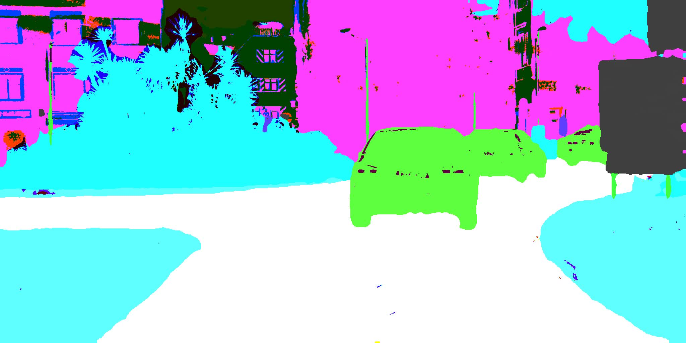

# How to run this Demo for paddle models



This topic demonstrates how to run Segmentation demo application, which does inference using Paddle semantic segmentation networks.

> **NOTE:** Only Paddle deeplabv3 and bisenet networks are verified by now.

## Install PaddleSeg

```sh
git clone https://github.com/PaddlePaddle/PaddleSeg.git
cd PaddleSeg
pip install -r requirements.txt 
```
> **NOTE**: Reference Link: https://github.com/PaddlePaddle/PaddleSeg/blob/release/2.2/README_CN.md

## Export model

```sh
mkdir bisenet && cd bisenet
wget https://paddleseg.bj.bcebos.com/dygraph/cityscapes/bisenet_cityscapes_1024x1024_160k/model.pdparams  // For deeplabv3: https://bj.bcebos.com/paddleseg/dygraph/cityscapes/deeplabv3_resnet50_os8_cityscapes_1024x512_80k/model.pdparams
cd ..
python export.py \
       --config configs/bisenet/bisenet_cityscapes_1024x1024_160k.yml \
       --model_path bisenet/model.pdparams  //the exported models will be in `./output` folder
```

## (Optional)Get inference results from Paddle framework

* Download a test image, such as: https://paddleseg.bj.bcebos.com/dygraph/demo/cityscapes_demo.png to `output` folder.
* 
```sh
python deploy/python/infer.py --config ./output/deploy.yaml --image_path ./output/cityscapes_demo.png  --save_dir ./output/output_result // output result will be save in `output/output_result`.
```

## (Optional)Convert paddle model to Openvino xml(.bin) model by model-optimizer

*  install (or build from source code) openvino model-optimizer
*  
```sh
// for bisenet
python3 mo.py --input_model ~/my_model/bisenet/model.pdmodel --output_dir ~/my_model/bisenet/IR/ --input_shape=[1,3,1024,1024] --framework=paddle --data_type=FP32 --reverse_input_channels --input=x --output=save_infer_model/scale_0.tmp_1

// for deeplabv3
python3 mo.py --input_model ~/my_model/deeplabv3/model.pdmodel --output_dir ~/my_model/deeplabv3/IR/fix_shape --input_shape=[1,3,512,1024] --framework=paddle --data_type=FP32 --reverse_input_channels --input=x --output=save_infer_model/scale_0.tmp_1
```

> **NOTE**: Reference Link: https://github.com/openvinotoolkit/openvino/blob/35e6c51fc0871bade7a2c039a19d8f5af9a5ea9e/docs/MO_DG/prepare_model/convert_model/Convert_Model_From_Paddle.md

## Build Open Model Zoo Demos

```sh
git clone https://github.com/openvinotoolkit/open_model_zoo.git
mkdir build
cd build

source /openvino/bin/setupvars.sh
export OpenCV_DIR=/openvino/inference-engine/temp/opencv_4.5.2_ubuntu20/opencv

cmake -DCMAKE_BUILD_TYPE=Debug ../demos
cmake --build . --target segmentation_demo  //this will build `segmentation_demo` only
```

## Run

*  C++ demo:
```sh
cd open_model_zoo/build/intel64/Debug
source /openvino/bin/setupvars.sh
// for bisenet
./segmentation_demo -d CPU -i ~/PaddleSeg/output/cityscapes_demo.png -m ~/my_model/bisenet/IR/model.xml -o ~/seg_result.png  // xml model
./segmentation_demo -d CPU -i ~/PaddleSeg/output/cityscapes_demo.png -m ~/my_model/bisenet/model.pdmodel -o ~/seg_result.png  // pdmodel model
// for deeplabv3
./segmentation_demo -d CPU -i ~/PaddleSeg/output/cityscapes_demo.png -m ~/my_model/deeplabv3/IR/fix_shape/model.xml -o ~/seg_result.png   // xml model
./segmentation_demo -d CPU -i ~/PaddleSeg/output/cityscapes_demo.png -m ~/my_model/deeplabv3/model.pdmodel -o ~/seg_result.png   // pdmodel model
```
*  Python demo:
```sh
cd open_model_zoo/demos/segmentation_demo/python
source /openvino/bin/setupvars.sh
// for bisenet
python3 segmentation_demo.py -d CPU -i ~/PaddleSeg/output/cityscapes_demo.png -m ~/my_model/bisenet/IR/model.xml -o ~/seg_result.png  // xml model
python3 segmentation_demo.py -d CPU -i ~/PaddleSeg/output/cityscapes_demo.png -m ~/my_model/bisenet/model.pdmodel  -o ~/seg_result.png  // pdmodel model
// for deeplabv3
python3 segmentation_demo.py -d CPU -i ~/PaddleSeg/output/cityscapes_demo.png -m ~/my_model/deeplabv3/IR/fix_shape/model.xml -o ~/seg_result.png  // xml model
python3 segmentation_demo.py -d CPU -i ~/PaddleSeg/output/cityscapes_demo.png -m ~/my_model/deeplabv3/model.pdmodel -o ~/seg_result.png  // pdmodel model
```
## Kown limiations
*  when Run the `.pdmodel` format model, cnnNetwork need to reshape its input shape. To demonstrate this paddle model method more concisely, by now the `reshape size` is fixed in the code, so when run this format model, `reshape size` need to be manually changed for `bisenet` and `deeplabv3`, code lie in:

```
demos/common/cpp/models/src/model_base.cpp
demos/common/python/models/model.py
```

